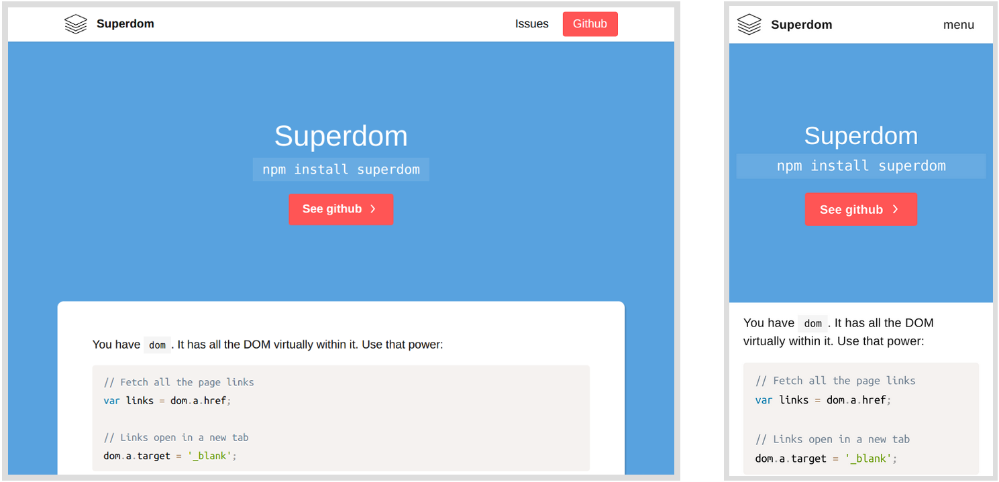

# Repository

Designs beautiful websites for your repositories and allow you to personalize them easily. See [an example with my own library](/franciscop/superdom):

You will get all of the files in your repository's `/docs` (standard place to publish websites) and a webhook attached that will recompile everything when your `README.md` or `documentation.md` change.

## Pricing

The website builder is free for everyone to use for one repository, but if you want advanced features or several repositories we're asking for some investment:

<table class="price">
  <tr>
    <th><h3>Personal<h3></th>
    <th><h3>Pro</h3></th>
    <th><h3>Enterprise</h3></th>
  </tr>

  <tr>
    <td><strong>1</strong> repository</td>
    <td><strong>5</strong> repositories</td>
    <td><strong>100</strong> repositories</td>
  </tr>

  <tr>
    <td>Auto deploy</td>
    <td>Auto deploy & update</td>
    <td>Auto deploy & update</td>
  </tr>

  <tr>
    <td>No support</td>
    <td>Github issues</td>
    <td>Email support</td>
  </tr>

  <tr>
    <td><strong>Free</strong></td>
    <td><strong>5$ / month</strong></td>
    <td><strong>100$ / month</strong></td>
  </tr>

  <tr>
    <td><a class="button" href="/#body">Use for free</a></td>
    <td><a href="/buypro"><button>Buy with Paypal</button></a></td>
    <td><a href="/buyenterprise"><button>Buy with Paypal</button></a></td>
  </tr>

  <tr>
    <td></td>
    <td>Cancel any time</td>
    <td>Cancel any time</td>
  </tr>
</table>

  

    <h2>Personal</h2>
    
<strong>1</strong> repository

    
Auto deploy

    
No support

    
<strong>Free</strong>

    
<a class="button" href="/#body">Use for free</a>

  

  

    <h2>Pro</h2>
    
<strong>5</strong> repositories

    
Auto deploy & update

    
Github issues

    
<strong>5$ / month</strong>

    
<a href="/buypro"><button>Buy with Paypal</button></a>

    
Cancel any time

  

  

    <h2>Enterprise</h2>
    
<strong>100</strong> repositories

    
Auto deploy & update

    
Email support

    
<strong>100$ / month</strong>

    
<a href="/buyenterprise"><button>Buy with Paypal</button></a>

    
Cancel any time

  

## Hire me

I am available for design and full stack work related to this or totally unrelated to this project. Have a look at my [my website](http://francisco.io/) or [my github](https://github.com/franciscop) to see more of my projects.

## License

The code generated with https://repo.site/ and the demo project are licensed under the MIT License, so there's no problem including those in your repository.

## Credit

This is based on quite a few projects, some of those mine:

- [Paperdocs](http://francisco.io/paperdocs/): for the base style of this website.
- [Picnic CSS](https://picnicss.com/): on which paperdocs is built.
- [Umbrella JS](https://umbrellajs.com/): a small jQuery alternative.
- [Github API](https://developer.github.com/v3/): it is an awesome API.
- [Cloudflare CDN](https://cloudflare.com/): for the HTTPS and cache.
